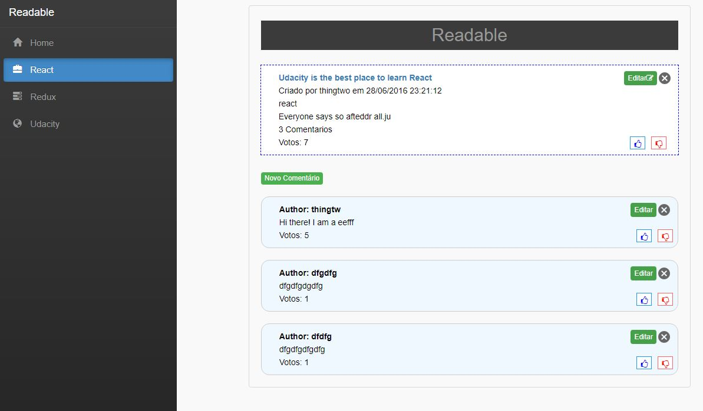

# READABLE

Readable is an app for posts and comments like Hacker News and Reddit. Users will be able to post content in predefined categories, comment on their posts and posts by other users, and vote on posts and comments. Users will also be able to edit and delete posts and comments.


### Instalando

```
clone git https://github.com/gilmarvoge/readable.git
cd readable

#api-server
-cd readable/api-server
-npm install
-npm start

#front-end.
-cd readable
-npm install
-npm start

```
### Functionality (requirements)

- Standard (root)
    - must list all available categories, which should be linked to a category view for that category
    - must list all posts
    - must have control to change the sorting method for the list, including at a minimum, sort by voteScore and sort by Timestamp
    - must have a control to add a new post
- Category view
    - identical to the standard view, but filtered to include only posts with the selected category
- Post Detail View
    - must show the details of a post, including: Title, Body, Author, timestamp (in user-readable format) and vote score
    - must list all comments for that post
    - must have controls to edit or delete the post
    - must have a control to add a new comment.
    - Implement the form of comments you want (inline, modal, etc.)
    - comments must also have controls to edit or delete
- Create / Edit Posts
    - must have a form to create a new post or edit existing posts
    - when editing, the existing data must be filled in the form

### Additional Functionality
#### Using Redux and Redux-Saga
Using redux and redux-saga is easier to manage asynchronous states and things, more efficient to perform, simple to test and better at handling failures.


